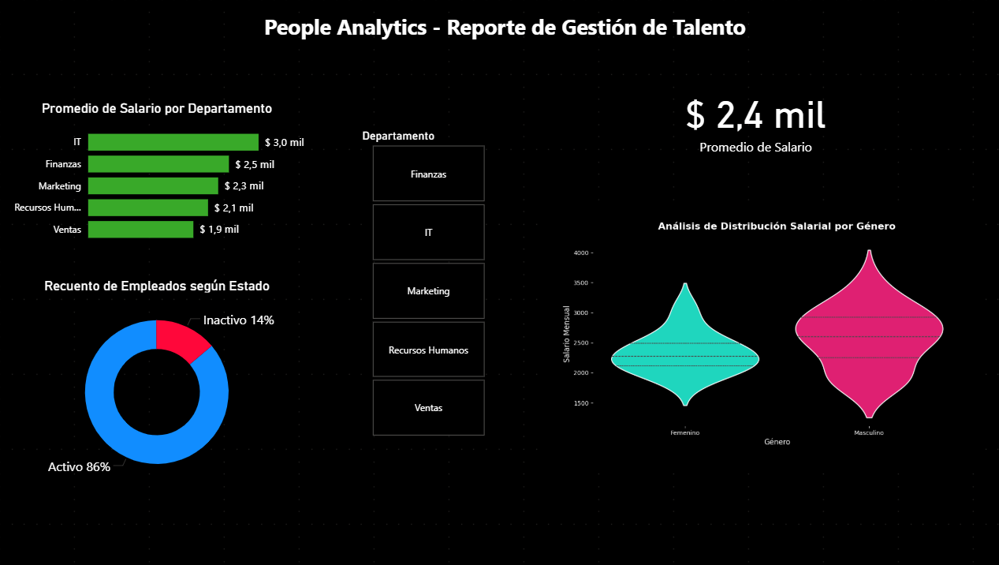

# 👥 People Analytics & Workforce Intelligence

Análisis estratégico de talento orientado a identificar patrones de rotación, desempeño y distribución salarial para optimizar decisiones de Recursos Humanos mediante analítica avanzada y visualización ejecutiva.

---

# 🎯 Objetivo del Proyecto

Desarrollar un sistema de análisis de talento que permita detectar riesgos organizacionales vinculados a:

- Rotación de personal
- Desempeño operativo
- Equidad salarial
- Eficiencia organizacional

El proyecto busca transformar datos de RRHH en insights accionables para mejorar retención, productividad y asignación de recursos humanos.

---

# 🧠 Problema de Negocio

La organización no contaba con visibilidad centralizada sobre indicadores críticos de talento, generando:

- Alta dificultad para detectar áreas con rotación crítica
- Falta de seguimiento del desempeño organizacional
- Escasa transparencia en distribución salarial
- Baja capacidad de anticipación sobre riesgos de talento

👉 Pregunta central del análisis:

**¿Qué patrones organizacionales están impactando la retención y el desempeño del talento, y cómo pueden mitigarse mediante decisiones basadas en datos?**

---

# 🚀 Resultados Clave del Negocio

| KPI Estratégico | Resultado |
|---|---|
| Concentración de rotación | 68% de la rotación concentrada en el 24% de las áreas |
| Brecha de desempeño | Equipos de bajo rendimiento con hasta 32% menos cumplimiento de objetivos |
| Riesgo de fuga de talento | 57% de las desvinculaciones asociadas a empleados con baja satisfacción |
| Equidad salarial | Diferencias salariales promedio de hasta 18% entre segmentos comparables |
| Optimización organizacional | Potencial mejora del 22% en eficiencia mediante estrategias focalizadas de retención y capacitación |

---

# 📊 Dashboard Ejecutivo

🔗 **Acceso al dashboard interactivo:**  
👉 [People Analytics Dashboard](https://github.com/GuilleBerrutti/people-analytics-dashboard/blob/main/dashboard_gestion_talento.pbix)

---

### 🐍 Análisis Estadístico
Se utilizó Python para analizar la distribución salarial y detectar patrones de variación entre segmentos organizacionales.

👉 [Ver script de análisis salarial](https://github.com/GuilleBerrutti/people-analytics-performance-and-salary-equity/blob/main/salary_distribution_analysis.py)
